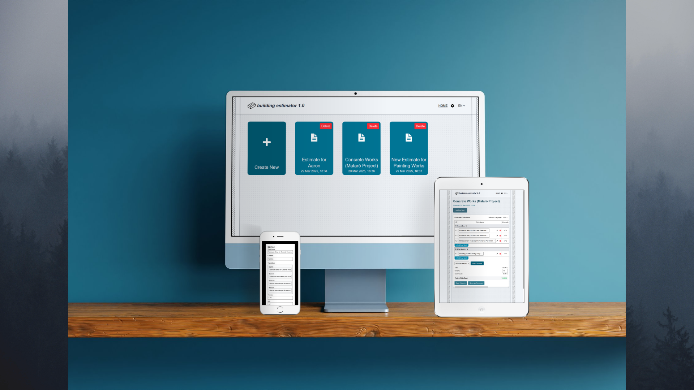
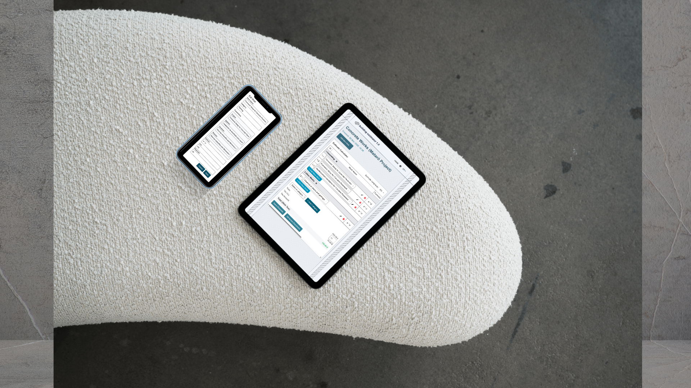
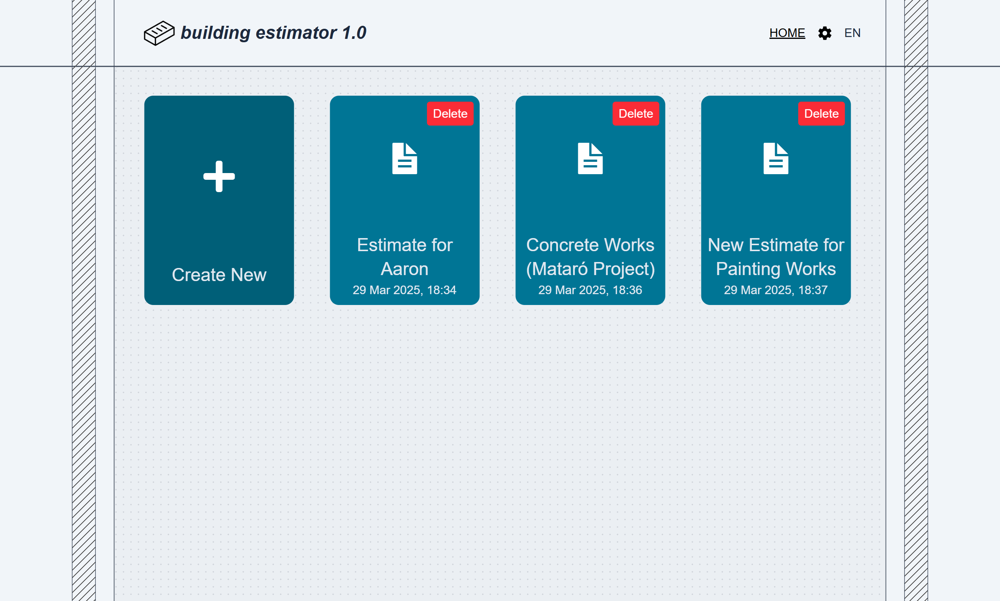
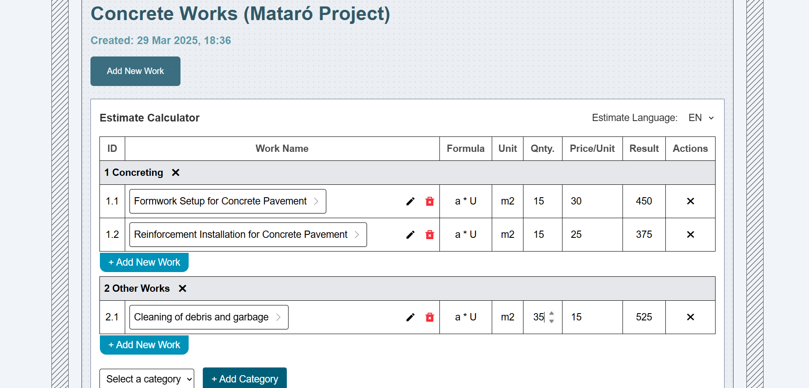
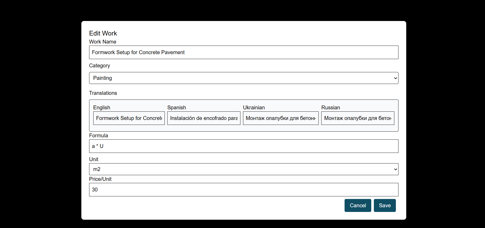
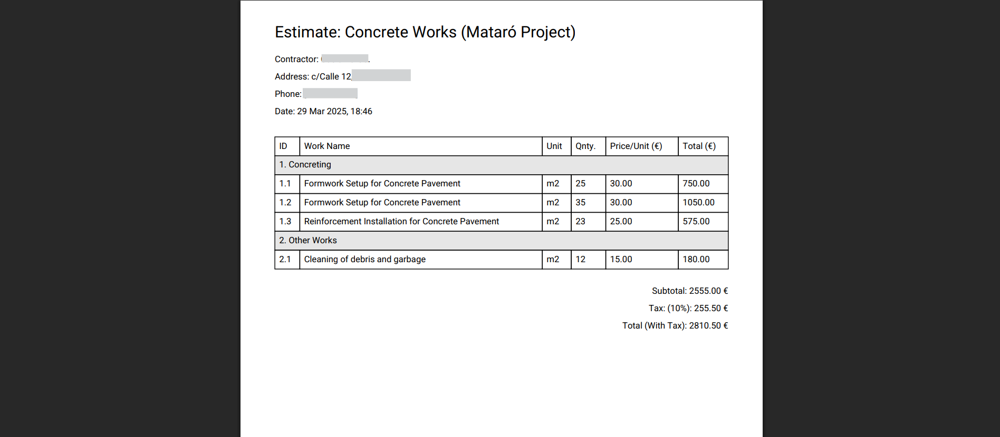

# Building Price Estimator

<p align="center">
  
</p>

**Building Price Estimator** is a web application that helps users calculate the estimated cost of constructing residential or commercial buildings. It offers a user-friendly interface to input various construction parameters and calculate cost with PDF document generation.

## Features

- Input project parameters (work name, price for unit, unit type, etc.)
- Real-time cost estimation based on dynamic user input
- Local data persistence using IndexedDB
- Project history: create, edit, delete and revisit past estimates
- Accessible modal/dialogs with Headless UI
- PDF document generation
- Smooth animations and transitions with Framer Motion
- Responsive design optimized for mobile and desktop

<p align="center">
  
</p>

## Screenshots

### Home Page



### Estimation Table



### Work Editing



### PDF Generation



## Demo

> 🌐 Live Demo: [building-estimator-rho.vercel.app](https://building-estimator-rho.vercel.app/)

## Tech Stack

**Frontend:**

- React
- Tailwind CSS
- IndexedDB (via Dexie)
- Headless UI (for accessible UI components)
- Framer Motion (for animations)

**Tools:**

- Vite
- Git & GitHub
- Figma (for UI design)

Deployed on Vercel

## Getting Started

### 1. Clone the repository

```bash
git clone https://github.com/your-username/building-estimator.git
cd building-estimator
```

### 2. Install dependencies

```bash
npm i
```

### 3. Run the development server

```bash
npm run dev
```

App will be available at http://localhost:5173 by default.

## Contributing

Feel free to fork this repo and open pull requests. Feedback, issues, and feature requests are very welcome!

## License

This project is licensed under the MIT License.

## Contact

Email: ivan.bodnarash.dev@gmail.com

Portfolio: https://ivanbodnarash.vercel.app

LinkedIn: https://www.linkedin.com/in/ivan-bodnarash
